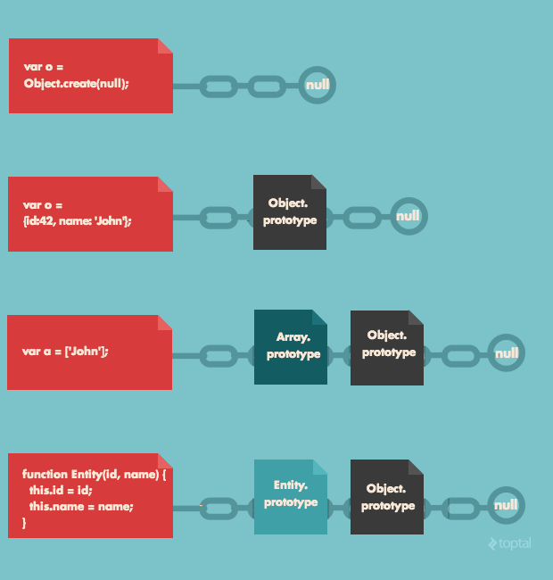

# 揭秘 JavaScript 的 “new” 关键字

## JavaScript中的面向对象编程

面向对象编程（OOP）是一种基于“对象”概念的编程范例。数据和函数（属性和方法）捆绑在一个对象内。

JavaScript 中的对象是键值对的集合。这些键值对是对象的属性。属性可以是数组、函数、对象本身或任何原始数据类型。

接下来我们看 JavaScript 工具箱中有哪些用于对象创建的技术？

假设我们正在刚刚设计的游戏中创建用户。我们如何存储用户详细信息（例如姓名、积分）以及实现方法（例如积分增加）？以下是基本对象创建的两个选项。

## 选项 1 — 对象文字表示法

```JavaScript

let user1 = {
    name: "Taylor",
    points: 5,
    increment: function() {
        user1.points++;
    }
};

```

JavaScript 对象文字是用花括号括起来的名称/值对的列表。在上面的示例中，创建了对象“user1”，并将关联数据存储在其中。

## 选项 2 — Object.create()

Object.create(proto, [ propertiesObject ])

Object.create方法接受两个参数：
- proto：新创建对象的原型对象。它必须是一个对象或 null。
- propertiesObject：新对象的属性。该参数是可选的。

基本上，您传递 Object.create 一个要继承的对象，它返回一个继承自您传递给它的对象的新对象。

```JavaScript

let user2 = Object.create(null);

user2.name = "Cam";
user2.points = 8;
user2.increment = function() {
  user2.points++;
}

```

上面的基本对象创建选项是重复的。它要求每一项都手动创建。

我们如何克服这个问题？

## 解决方案 1 — 使用函数生成对象

一个简单的解决方案是编写一个函数来创建新用户。

```JavaScript

function createUser(name, points) {
  let newUser = {};
  newUser.name = name;
  newUser.points = points;
  newUser.increment = function() {
    newUser.points++;
  };
  return newUser;
}

let user1 = createUser("Bob", 5);
let user2 = createUser("Bob", 5);
user1.increment();
user2.increment();

```

然而，上例中每个对象的增量函数只是原始增量函数的副本。这不是编写代码的好方法，因为对每个对象的函数的任何潜在更改都需要手动完成。

## 解决方案 2 — 使用 JavaScript 的原型性质

与 Python 和 Java 等面向对象语言不同，JavaScript 没有类。它使用原型和原型链的概念进行继承。

创建新数组时，您会自动访问内置方法，例如Array.join、Array.sort和Array.filter。这是因为数组对象继承了 Array.prototype 的属性。



每个 JavaScript 函数都有一个 prototype 属性，默认情况下该属性为空。您可以向此原型属性添加函数，在这种形式下，它被称为方法。当继承的函数执行时，this 的值指向继承对象。

```JavaScript

function createUser(name, points) {
  let newUser = Object.create(userFunction);
  newUser.name = name;
  newUser.points = points;
  return newUser;
}

let userFunction = {
  increment: function() { this.points++ };
  login: function() { console.log("Please login.") };
}

let user1 = createUser("Bob", 5);
user1.increment();

```

当 user1 对象被创建时，就形成了与 userFunction 的原型链绑定。

当 user1.increment() 位于调用堆栈中时，解释器将在全局内存中查找 user1。接下来，它会寻找增量函数，但找不到。解释器将查看原型链上的下一个对象，并在那里找到增量函数。

## 解决方案 3 — new 和 this 关键字

new 运算符用于创建具有构造函数的对象实例。

当我们用 new 调用构造函数时，我们会自动执行以下操作：

- 创建了一个新对象
- 它绑定 this 到对象
- 构造函数的原型对象成为新对象的 ```__proto__``` 属性
- 从函数返回对象

这太棒了，因为自动化可以减少重复代码！

```JavaScript

function User(name, points) {
 this.name = name; 
 this.points = points;
}
User.prototype.increment = function(){
 this.points++;
}
User.prototype.login = function() {
 console.log(“Please login.”)
}

let user1 = new User(“Dylan”, 6);
user1.increment();

```

通过使用原型模式，每个方法和属性都直接添加到对象的原型上。

解释器会沿着原型链往上走，找到 User 的 prototype 属性下的increment 函数，它本身也是一个对象，里面有信息。请记住——JavaScript 中的所有函数也是对象。现在解释器已经找到了它需要的东西，它可以创建一个新的本地执行上下文来运行 user1.increment()。

## 旁注：```__proto__``` 和原型之间的区别

Prototype 是构造函数的一个属性，它决定了构造对象上的 ```__proto__``` 属性。

因此， ```__proto__``` 是创建的引用，该引用称为原型链接。

## 解决方案 4 — ES6“语法糖”

其他语言允许我们在对象“构造函数”本身中编写共享方法。ECMAScript6 引入了 class 关键字，它允许我们编写类似于其他经典语言的普通类的类。事实上，它是 JavaScript 原型行为的语法糖。

```JavaScript

class User {
    constructor(name, points) {
    this.name = name;
    this.points = points;
  }
  increment () {
    this.points++;
  }
  login () {
    console.log("Please login.")
  }
}

let user1 = new User("John", 12);
user1.increment();

```

在解决方案 3 中，相关方法是使用精确实现的
User.prototype.functionName。在此解决方案中，实现了相同的结果，但语法看起来更清晰。